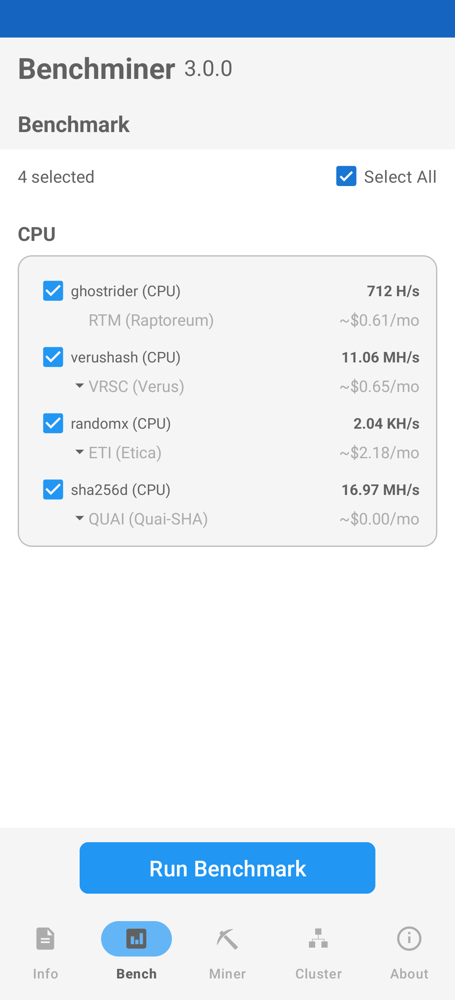
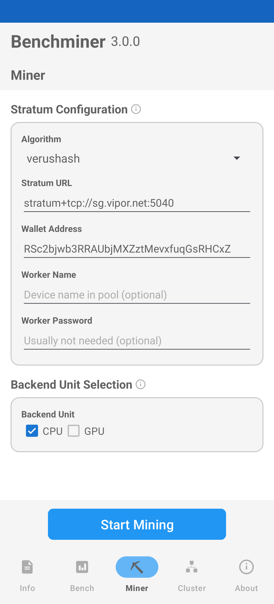
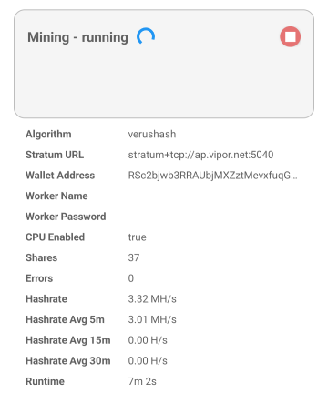
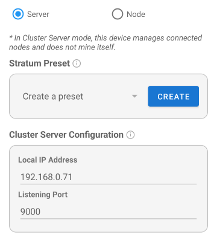
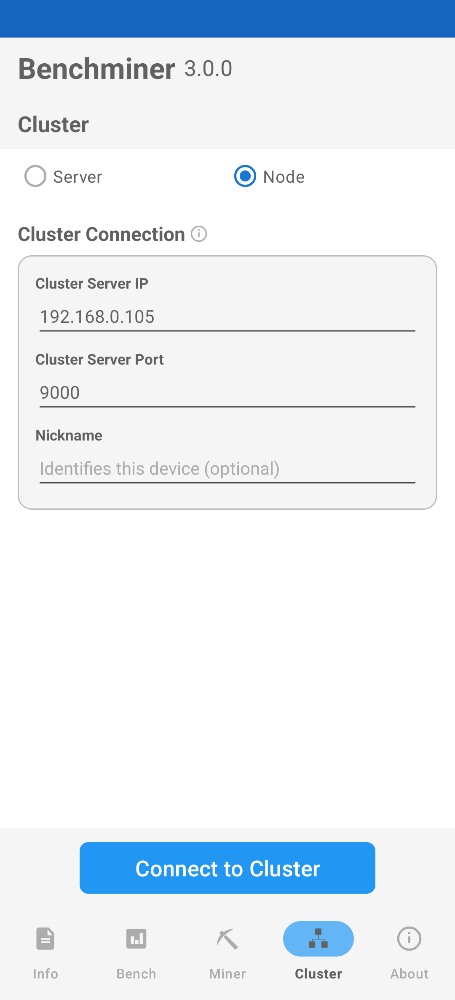

# Benchminer User Guide

This guide will help you get started with cryptocurrency mining using Benchminer.

## Table of Contents

1. [Run Benchmark First](#1-run-benchmark-first)
2. [Prepare Wallet and Mining Pool](#2-prepare-wallet-and-mining-pool)
3. [Start Mining](#3-start-mining)
4. [Troubleshooting](#4-troubleshooting)

**Advanced**
- [Cluster Mode](#cluster-mode)

---

## 1. Run Benchmark First

After installing the app, run benchmarks to check your device's mining performance.

### 1.1 Select Benchmark Options

1. Open the app and tap the **Bench** tab
2. You'll see a list of available algorithms grouped by backend (CPU, GPU)
3. Check the algorithms you want to benchmark, or use **Select All**
4. Tap the **Run Benchmark** button

Each benchmark takes approximately 1 minute per algorithm.

### 1.2 Check Results and Profitability

After benchmarks complete, you'll see:
- **Hashrate:** Your device's mining speed for each algorithm
- **Estimated Profit:** Expected monthly earnings in USD

Tap on any algorithm to expand and see the list of coins you can mine with that algorithm, along with their individual profit estimates.

> **Note:** The profit shown is the estimated **monthly** earnings based on your device's measured hashrate and current coin prices.

### 1.3 Choose a Coin to Mine

Based on the profitability results, decide which coin you want to mine. Consider:
- Which algorithm shows the highest profit on your device
- Which coins interest you
- Current market conditions

<!-- Screenshot: Benchmark screen showing profit estimates -->

---

## 2. Prepare Wallet and Mining Pool

Once you've chosen a coin to mine, you need to prepare two things: a wallet and a mining pool.

### 2.1 Create a Wallet

You need a wallet to receive your mining rewards.

Search **"[Coin Name] official wallet"** on Google to find and download the official wallet for your chosen coin.

> **Important:** Wallets contain sensitive information. Always download from official sources only. Keep your recovery phrase safe and never share it with anyone.

After creating your wallet, copy your **wallet address** - you'll need it for mining setup.

### 2.2 Find a Mining Pool

Solo mining on a mobile device is not practical. Join a mining pool to combine your hashrate with other miners and receive regular payouts.

Search **"[Coin Name] mining pool"** on Google to find available pools.

When selecting a pool, consider:
- Pool fee (typically 0.5% - 2%)
- Minimum payout threshold
- Server location (closer = lower latency)

After choosing a pool, you'll need:
- **Stratum URL:** The pool's server address (e.g., `stratum+tcp://pool.example.com:3333`)
- **Any specific requirements:** Some pools require specific worker name formats

---

## 3. Start Mining

Now you have everything ready. Let's configure and start mining.

### 3.1 Configure Mining Settings

1. Tap the **Miner** tab
2. Fill in the following fields:

| Field | Description | Example |
|-------|-------------|---------|
| **Algorithm** | Select the algorithm for your chosen coin | `verushash` |
| **Stratum URL** | Pool server address (from your pool's website) | `stratum+tcp://pool.example.com:3333` |
| **Wallet Address** | Your wallet address | `RKjfm8pY2bZ...` |
| **Worker Name** | Name to identify this device (optional) | `my_phone` |
| **Worker Password** | Pool password if required (optional, usually `x`) | `x` |

### 3.2 Select Backend

Choose which hardware to use:
- **CPU:** Enable to use your device's processor
- **GPU:** Enable to use graphics processor (if supported)

Check the **Info** tab to see which backends your device supports for each algorithm.

<!-- Screenshot: Miner tab with settings filled in -->

### 3.3 Start and Monitor

1. Tap **Start Mining**
2. The monitoring screen shows:
   - Current mining status and elapsed time at the top
   - **Hashrate:** Current mining speed with history chart
   - **Shares:** Accepted work submissions
   - **Errors:** Rejected or failed submissions

<!-- Screenshot: Mining monitor showing hashrate and stats -->

3. To stop mining, tap the **Stop** button or press the back button

> **Note:** Mining only runs while the app is in the foreground. If you switch to another app or lock your screen, mining will stop automatically.

### 3.4 Verify on Pool Website

After mining for a few minutes, verify your connection on your pool's website:
1. Go to your pool's dashboard
2. Enter your wallet address
3. Check that your worker is connected and shares are being submitted
4. Monitor your pending balance and estimated payout

---

## 4. Troubleshooting

### Connection Issues

| Problem | Solution |
|---------|----------|
| "Connection failed" | Check internet connection and verify Stratum URL is correct |
| "Authentication failed" | Verify wallet address is valid for the selected coin |
| No shares submitted | Wait a few minutes; share frequency depends on difficulty and hashrate |

### Performance Issues

| Problem | Solution |
|---------|----------|
| Low hashrate | Close other apps, disable battery saver mode |
| Device overheating | Take breaks to prevent thermal throttling |
| App crashes | Free up RAM by closing background apps |
| Battery draining fast | Normal for mining; connect to power for extended sessions |

### Tips for Best Results

- Keep the app in foreground for best performance
- Connect to power when mining for extended periods
- Monitor device temperature
- Start with short sessions to test stability

---

## Advanced

### Cluster Mode

If you're mining with multiple devices, cluster mode helps you manage them efficiently.

#### How Cluster Mode Works

- **Server Device:** Manages communication with the mining pool and controls all connected nodes. The server does not mine directly.
- **Node Devices:** Connect to the server and perform actual mining work.

All devices must be on the same local network (WiFi).

#### Server Setup

1. Tap the **Cluster** tab
2. Select **Server Mode**
3. Configure mining settings:
   - Algorithm
   - Stratum URL
   - Wallet address
   - Worker name (optional)
4. Set the **Listening Port** (default works for most cases)
5. Note the **Local IP Address** displayed on screen
6. Tap **Start Cluster**

Share the IP address and port with your node devices.

<!-- Screenshot: Cluster server mode setup -->

#### Node Setup

On each node device:

1. Tap the **Cluster** tab
2. Select **Node Mode**
3. Enter connection info:
   - **Cluster Server IP:** IP address shown on the server device
   - **Cluster Server Port:** Port number set on the server
   - **Nickname:** A name to identify this node (optional)
4. Tap **Connect to Cluster**

Once connected, the node will start mining automatically.

<!-- Screenshot: Cluster node mode setup -->

#### Monitor Cluster Mining

- On the server device, you can see all connected nodes and their status
- Check your pool's website to verify the combined hashrate from all nodes
- The pool will show your worker with the total hashrate from all cluster nodes

#### Cluster Connection Issues

| Problem | Solution |
|---------|----------|
| Node can't connect to server | Ensure both devices are on the same WiFi network |
| Can't find IP address | Tap the IP address on server device to refresh |
| Frequent disconnections | Check WiFi signal strength, move closer to router |

---

*For more information or to report issues, visit the [Benchminer GitHub repository](https://github.com/dev4excite/Benchminer).*
