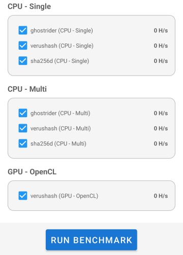
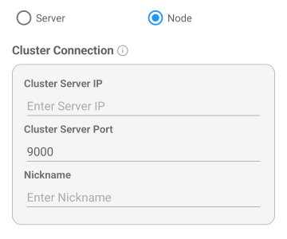

# USER GUIDE

## 1. App Overview and Main Navigation

The Benchminer app features five primary tabs located at the bottom of the screen:

- **Info**: View device specifications and supported algorithms
- **Bench**: Select and run benchmark tests
- **Miner**: Configure and launch mining sessions
- **Cluster**: Distributed mining using multiple devices over a local network
- **About**: View version and license information


---

## 2. Info - Device Specifications

This page displays technical details of your device including model, OS version, CPU, RAM, and GPU.  
It also shows a compatibility table listing which algorithms are supported on your device by CPU or GPU.


---

## 3. Bench - Running Benchmarks

1. Select one or more benchmark configurations, combining an algorithm with a compute backend (CPU/GPU).
   - Example: verushash (CPU - Multi), sha256d (CPU - Single)
   - Use **Select All** to run all benchmarks.
2. Tap the **RUN BENCHMARK** button to begin testing.
3. Each selected test takes approximately **1 minute** to complete.
4. After all tests finish, the app displays performance scores and stores average hashrates for future reference.



---

## 4. Getting Started with Mining

### What is Cryptocurrency Mining?

Mining is the process of validating cryptocurrency transactions and earning rewards. Benchminer supports mining these cryptocurrencies:

- **Verushash Algorithm**: Mines Verus Coin (VRSC) - Recommended for beginners
- **Ghostrider Algorithm**: Mines Raptoreum (RTM) - CPU intensive
- **Sha256d Algorithm**: Mines Bitcoin and similar coins - Less profitable on mobile

### Before You Start Mining

**Step 1: Get a Wallet Address**
- Search online for "[algorithm name] wallet" (e.g., "verushash wallet", "raptoreum wallet")
- Create a wallet and copy your receiving address
- Verushash addresses start with "R", Raptoreum with "R", Bitcoin with "1" or "3"

**Step 2: Choose a Mining Pool**
- Search for "[algorithm name] mining pool" 
- Look for pools with good reputation and low fees
- Note the pool's stratum URL and port from their "Getting Started" page

**Step 3: Run Benchmark First**
- Use the Bench tab to test your device performance
- This helps you choose the best algorithm and backend for your device

---

## 5. Miner - Detailed Setup Guide

### Creating Your First Preset

**1. Tap CREATE to add a new preset**

**Preset Title**
- Give your preset a memorable name
- Examples: "Verus Mining", "RTM Pool1", "My Bitcoin"
- This is just for your reference

**Algorithm Name**
- **For beginners: Choose "verushash"** - works on both CPU and GPU
- **ghostrider**: CPU only, more complex
- **sha256d**: CPU only, lower profitability on mobile devices

**Pool URL - Most Important Setting**
1. Visit your chosen mining pool's website
2. Find their "Getting Started" or "How to Mine" page
3. Copy the Stratum URL exactly as shown
4. Common formats:
   - `stratum+tcp://pool.example.com:4444`
   - `stratum+ssl://secure-pool.example.com:4445`
   - Some pools use just `pool.example.com:4444`

**Wallet Address**
- Paste your wallet address here (the long string from Step 1 above)
- **Double-check this carefully** - wrong address = lost rewards
- Must match the algorithm (Verushash wallets for verushash, etc.)

**Worker Name (Optional)**
- Identifies this device if you mine from multiple devices
- Examples: "phone", "tablet", "android1"
- Leave blank if you're only using one device

**Password (Optional)**
- Most pools use "x" or leave this blank
- Check your pool's documentation if unsure
### Complete Example Setup

Here's a real example for Verushash mining:

```
Preset Title: "My Verus Mining"
Algorithm: verushash
Pool URL: stratum+tcp://pool.verus.io:9999
Wallet Address: RYourLongVerusWalletAddressHere123456789abcdef
Worker Name: phone (or leave blank)
Password: x (or leave blank)
```

**2. Choose Compute Backend**
- **CPU**: Available on all devices, good for ghostrider
- **OpenCL (GPU)**: Only for verushash, better performance if available
- **Vulkan/Metal/Cuda**: Device dependent, shown only if supported
- If unsure, start with CPU

**3. Tap START MINING**
- The app connects to the pool using your settings
- Wait a few seconds for connection to establish
- Mining will begin automatically once connected

**4. Monitor Your Mining**
The app displays real-time information:
- **Hashrate**: Your mining speed (higher is better)
- **Shares**: Successful work submissions to the pool
- **Errors**: Connection or validation issues (should be low)
- **Algorithm & Pool**: Confirms your settings are active


---

## 6. Cluster - Distributed Mining Mode

Cluster mode allows you to distribute mining jobs across multiple devices in the same local network.

### Cluster Server Mode

- Acts as a central job coordinator
- Connects to a Stratum pool and distributes mining jobs to other devices
- Does not mine itself
- Required settings:
  - **Select a Stratum preset**
  - **Listening Port**: Port for incoming node connections
  - **Local IP Address**: Auto-detected for display


### Cluster Node Mode

- Connects to a Cluster Server and performs mining work assigned by the server
- Required settings:
  - **Server IP**: IP address of the Cluster Server
  - **Server Port**: Must match the server’s listening port
  - **Nickname**: Friendly name to identify the device in the cluster



---

## 7. Preset Management Tips

- The same preset list is shared between Miner and Cluster modes
- Up to **5 presets** can be stored
- Use the **+** button to add a new preset
- Presets can be edited or deleted anytime and persist after app restarts


---

## 8. Troubleshooting Guide - Enhanced

### Common Setup Issues

**"Mining won't start" or "Connection failed"**
- **Check Pool URL format**: Must include `stratum+tcp://` or `ssl://` prefix
- **Verify pool is online**: Visit the pool website to check status
- **Test internet connection**: Try browsing a website
- **Check firewall/VPN**: Some networks block mining connections

**"Invalid address" or "Address rejected"**
- **Algorithm mismatch**: Ensure wallet matches algorithm (Verushash wallet for verushash mining)
- **Copy-paste error**: Re-copy wallet address from your wallet app
- **Wrong address format**: Bitcoin addresses look different from Verushash addresses

**"GPU backend doesn't work"**
- **Algorithm limitation**: Only verushash supports GPU (OpenCL)
- **Device compatibility**: Not all devices have OpenCL support
- **Try CPU instead**: CPU works on all devices for all algorithms

**"Very low hashrate" or "Zero performance"**
- **Wrong backend selected**: Try switching between CPU and GPU
- **Device overheating**: Let device cool down and try again
- **Background apps**: Close other apps to free up resources
- **Power saving mode**: Disable battery optimization for Benchminer

### Connection and Pool Issues

**"Pool rejected shares"**
- **Outdated pool information**: Check if pool changed their settings
- **Worker name conflicts**: Try changing or removing worker name
- **Pool maintenance**: Try a different pool temporarily

**"High error rate"**
- **Network instability**: Check WiFi signal strength
- **Pool overloaded**: Try mining during off-peak hours
- **Wrong pool port**: Double-check port number in pool documentation

### Performance Issues

**"Mining stops after a while"**
- **Battery optimization**: Disable battery optimization for Benchminer in Android settings
- **Thermal throttling**: Device automatically slows down when hot
- **Memory issues**: Close other apps to free up RAM

**"App crashes during mining"**
- **Insufficient memory**: Try CPU backend instead of GPU
- **Device overheating**: Take breaks between mining sessions
- **Restart app**: Force-close and reopen Benchminer

---

## 9. Additional Mining Tutorials

For detailed guides on specific cryptocurrencies:
- **Bitcoin (SHA256d) Mining**: See [TUTORIAL_BITCOIN.md](TUTORIAL_BITCOIN.md)
- **Verushash Mining**: Covered in Section 5 above (recommended for beginners)
- **Ghostrider Mining**: Similar to Verushash setup, but CPU-only
